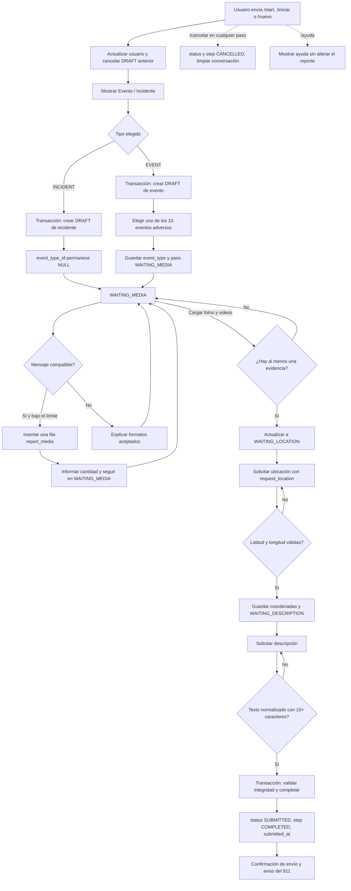
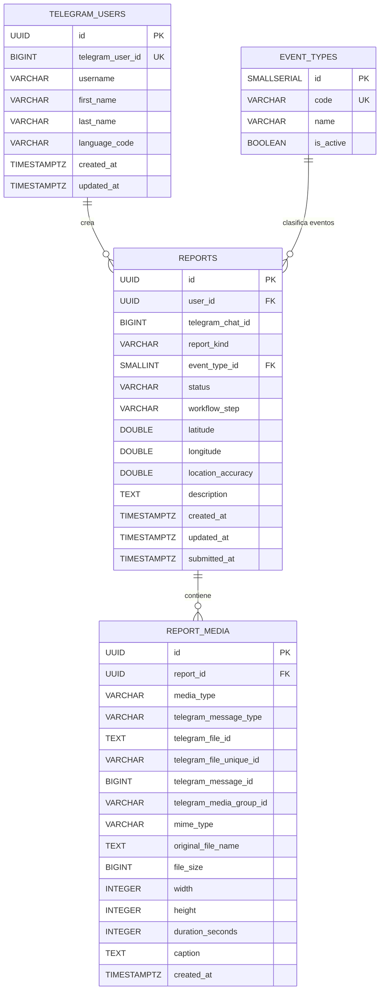

# Galápagos Previene

Bot conversacional de Telegram para registrar eventos e incidentes en la
provincia de Galápagos. El ciudadano adjunta una o más fotografías o vídeos,
comparte una ubicación y escribe una descripción; PostgreSQL conserva el
reporte y los metadatos, mientras que **Telegram continúa siendo el único
almacenamiento de las evidencias**.

El proyecto usa Python 3.11+, `python-telegram-bot` 22.8, `asyncpg`, PostgreSQL
y Docker Compose. En desarrollo recibe actualizaciones mediante *polling* y su
separación entre handlers, servicios y repositorios permite cambiar el
transporte a webhook sin reescribir el flujo.

## Qué permite hacer

- `/start`, `/iniciar` y `/nuevo` comienzan el mismo flujo.
- Un reporte puede ser `EVENT` (uno de los diez eventos adversos activos del
  catálogo oficial) o `INCIDENT`.
- Acepta fotos, vídeos, imágenes/vídeos como documento y cada elemento de un
  álbum como una evidencia independiente.
- No descarga archivos ni guarda binarios o URL temporales.
- Guarda `telegram_file_id` para reenviar posteriormente el archivo con el
  mismo bot y `telegram_file_unique_id` para reconocerlo.
- Exige al menos una evidencia, ubicación válida y descripción de diez o más
  caracteres antes de enviar el reporte.
- Impide más de un borrador activo por usuario y evita duplicar un archivo si
  Telegram reentrega la misma actualización.
- Inicializa el esquema y los tipos de evento, configura el menú de comandos y
  cierra correctamente el pool de PostgreSQL al detenerse.

## Arquitectura del proyecto

```text
GalapagosPreviene/
├── app/
│   ├── __init__.py
│   ├── bot.py                  # Construcción y ciclo de vida de Application
│   ├── config.py               # Variables de entorno y validación
│   ├── database.py             # Pool asyncpg e inicialización del esquema
│   ├── keyboards.py            # Teclados inline y botón de ubicación
│   ├── models.py               # Enums y dataclasses del dominio
│   ├── states.py               # Estados de ConversationHandler
│   ├── handlers/
│   │   ├── __init__.py
│   │   ├── commands.py         # /start, /iniciar, /nuevo, /cancelar, /ayuda
│   │   ├── errors.py           # Manejo global de errores
│   │   └── report_flow.py      # Pasos y validaciones del reporte
│   ├── repositories/
│   │   ├── __init__.py
│   │   ├── media.py            # SQL de report_media
│   │   ├── reports.py          # SQL y transacciones de reports
│   │   └── users.py            # Alta/actualización de usuarios
│   └── services/
│       ├── __init__.py
│       └── telegram_media.py   # Extraer metadatos y reenviar por file_id
├── docs/
│   ├── example_queries.sql
│   └── galapagos-previene.service
├── tests/
│   ├── test_media_extraction.py
│   ├── test_report_flow.py
│   └── test_validations.py
├── .env.example
├── .gitignore
├── .python-version            # Versión recomendada para pyenv y similares
├── Dockerfile                # Imagen de producción del bot
├── .dockerignore
├── docker-compose.yml         # PostgreSQL + bot
├── main.py
├── pytest.ini
├── requirements.txt          # Dependencias de producción
├── requirements-dev.txt      # Producción + pytest (solo desarrollo)
├── schema.sql
└── README.md
```

La separación tiene una intención didáctica y práctica:

- `handlers` traduce cada `Update` de Telegram en una acción del flujo.
- `repositories` es la única capa que conoce SQL; usa parámetros (`$1`, `$2`,
  etc.) en lugar de concatenar datos del usuario.
- `services/telegram_media.py` entiende las variantes de archivo de Telegram,
  pero no decide el estado de una conversación.
- `models.py` comparte vocabulario tipado entre ambas capas. Los enums evitan
  escribir por accidente valores como `SUBMITED` o `PHOTOO`.
- `bot.py` compone la aplicación e instala los callbacks de inicio y apagado.
  `main.py` solo carga configuración, activa logging y arranca polling.

## Flujo del bot



Telegram envía cada archivo de un álbum como un `Update` separado. Por ello el
bot guarda `telegram_media_group_id`, pero **no espera que el álbum completo
llegue en un solo mensaje** ni avanza por tiempo: permanece en
`WAITING_MEDIA` hasta que el usuario pulse `Cargar fotos y videos`.

`ConversationHandler` requiere actualizaciones secuenciales. La aplicación se
construye con `concurrent_updates(False)` para que dos mensajes cercanos del
mismo usuario no compitan por el estado.

## Modelo entidad-relación



### Relaciones e integridad

Una relación **uno a muchos** significa que una fila padre puede relacionarse
con varias filas hijas. Un usuario puede crear muchos reportes, y un reporte
puede contener muchas evidencias. Cada evidencia necesita su propia fila porque
tiene un `file_id`, mensaje, MIME, dimensiones, duración y pie de foto propios;
guardar una lista dentro de `reports` haría más difíciles las restricciones,
consultas y reenvíos.

Una clave foránea obliga a que la fila referenciada exista:

- `reports.user_id → telegram_users.id`: ningún reporte queda sin usuario.
- `reports.event_type_id → event_types.id`: solo un evento puede usar un tipo
  catalogado. Es nullable porque un incidente debe mantenerlo en `NULL`.
- `report_media.report_id → reports.id ON DELETE CASCADE`: si una operación
  administrativa elimina físicamente un reporte, PostgreSQL elimina sus
  metadatos dependientes. `/cancelar` **no borra** nada; conserva el histórico.

Además de las claves foráneas, `schema.sql` aplica reglas cerca de los datos:

- checks para clases, estados, pasos, coordenadas, tamaños y dimensiones;
- coherencia de `EVENT`/`INCIDENT` al quedar `SUBMITTED`;
- índice único parcial sobre `user_id WHERE status = 'DRAFT'`;
- unicidad `(report_id, telegram_message_id)` contra actualizaciones repetidas;
- índices para buscar por reporte, `file_id`, `file_unique_id` y álbum.

Los UUID reducen la posibilidad de enumerar reportes y permiten generar claves
sin un contador central. La confirmación muestra solo los primeros ocho
caracteres como código amigable; para operaciones internas se conserva y usa el
UUID completo.

## Conceptos de Telegram explicados

### Bot, BotFather y token

Un bot es una cuenta de Telegram controlada por software. No inicia una
conversación con una persona por sí solo: el usuario abre el bot y pulsa
**Iniciar** o envía un mensaje. `@BotFather` es el bot oficial con el que se
crean y configuran otros bots.

BotFather entrega un **token**, una credencial que permite actuar como el bot.
Quien conoce el token puede enviar mensajes y consultar actualizaciones en su
nombre. Por eso se guarda en `TELEGRAM_BOT_TOKEN`, nunca en Python, capturas,
logs, commits ni tickets. Si se filtra, hay que revocarlo en BotFather y emitir
uno nuevo.

### Update, handler y ConversationHandler

Telegram representa cada interacción como un `Update`: puede contener un
mensaje, una ubicación o un `callback_query` originado en un botón inline. Un
**handler** filtra un tipo de actualización y llama a una corrutina `async`.
Por ejemplo, `CommandHandler` reconoce comandos, `CallbackQueryHandler` botones
inline y `MessageHandler` fotos, vídeos, ubicación o texto.

`ConversationHandler` agrupa esos handlers en una máquina de estados. La
corrutina devuelve el próximo entero (`CHOOSE_KIND`, `WAITING_MEDIA`, etc.) y
PTB usa ese valor para decidir qué handlers pueden atender el siguiente
`Update`. El paso importante también se persiste en `reports.workflow_step`;
así la base refleja el progreso aunque el estado en memoria sea temporal.

Los estados de PTB son:

1. `CHOOSE_KIND`: todavía no hay reporte; espera Evento o Incidente.
2. `CHOOSE_EVENT_TYPE`: solo para Evento.
3. `WAITING_MEDIA`: permite repetir el envío hasta el límite configurable.
4. `WAITING_LOCATION`: acepta una ubicación de Telegram.
5. `WAITING_DESCRIPTION`: recibe, limpia y valida texto.

En PostgreSQL también existen `COMPLETED` y `CANCELLED`, que son estados
terminales persistentes y no esperan otro mensaje.

### Botones inline y botón de ubicación

Los botones inline viajan dentro de un mensaje. Cada uno devuelve un
`callback_data` corto al bot; el código valida ese valor y nunca confía en texto
arbitrario del cliente. Sirven para tipo de reporte, tipo de evento y para
finalizar evidencias.

Telegram solo permite `request_location=True` en un botón de **teclado de
respuesta**, no en uno inline. El proyecto utiliza:

```python
KeyboardButton("📍 Compartir mi ubicación", request_location=True)
```

Al pulsarlo, Telegram pide consentimiento y envía un objeto `Location`. También
se acepta una ubicación elegida manualmente desde el mapa. El bot guarda
latitud, longitud y precisión por separado, tras comprobar los rangos
`[-90, 90]` y `[-180, 180]`.

### Dónde viven fotos y vídeos

Al recibir contenido, Telegram aporta dos identificadores:

- `file_id`: referencia reutilizable **por este bot** para enviar u obtener el
  archivo. Puede cambiar en determinadas circunstancias; se conserva el valor
  más reciente recibido.
- `file_unique_id`: identificador estable útil para reconocer el mismo archivo,
  pero no es aceptado para descargarlo ni reenviarlo.

`extract_media_data()` lee estos metadatos. Para una foto normal elige
`message.photo[-1]`, la mayor resolución incluida en el mensaje. Para un
documento solo acepta MIME `image/*` o `video/*`; el nombre de archivo nunca se
usa para ejecutar comandos ni para deducir que un contenido inseguro es válido.
Durante el registro no se llama a `get_file()` ni a `download_to_drive()`.

`get_file()` puede producir una ruta de descarga temporal, potencialmente con
información ligada al token. Esa URL expira, no es un enlace público y **no se
debe almacenar, exponer ni registrar en logs**. Si una tarea administrativa la
necesita, `get_temporary_telegram_file_url()` la solicita de nuevo al momento.
El dato permanente sigue siendo `telegram_file_id`.

## PostgreSQL asíncrono

`asyncpg.create_pool()` mantiene entre 1 y 10 conexiones reutilizables con un
timeout de comando de 30 segundos (valores configurables). Abrir una conexión
TCP y autenticar en cada mensaje sería lento; un pool presta una conexión por
el tiempo de una consulta o transacción y luego la devuelve. Se guarda en
`application.bot_data["db_pool"]` para compartirlo sin variables globales y se
cierra en el callback de apagado.

Una **transacción** agrupa cambios con semántica de todo o nada. El perfil del
usuario se sincroniza al ejecutar el comando; al elegir el tipo,
`create_draft()` bloquea esa fila, cancela cualquier borrador anterior y crea el
nuevo borrador de forma atómica. Al finalizar, otra transacción vuelve a
comprobar usuario, clasificación, evidencia, ubicación y descripción antes de
cambiar estado y fechas. Ante una excepción PostgreSQL revierte el conjunto,
evitando un reporte marcado `SUBMITTED` a medias.

Todas las consultas reciben valores como parámetros posicionales de asyncpg:

```python
row = await connection.fetchrow(
    "SELECT * FROM reports WHERE id = $1",
    report_id,
)
```

No se debe formar SQL con f-strings ni concatenar la descripción, username,
nombre de archivo o cualquier otro dato del cliente.

## Registrar y configurar el bot con BotFather

1. En Telegram, abra el usuario verificado `@BotFather` y pulse **Iniciar**.
2. Envíe `/newbot`. Como nombre visible escriba exactamente
   `Galápagos Previene` y como username pruebe `GalapagosPrevieneBot`. Telegram
   exige que termine en `bot` y que sea globalmente único; si ya está ocupado,
   elija una variante y recuerde actualizar los enlaces de difusión.
3. Copie el token recibido una sola vez a su `.env`. No lo pegue en el README ni
   lo envíe por chat.
4. Envíe `/setdescription`, seleccione el bot y pegue:

   ```text
   Galápagos Previene permite reportar eventos e incidentes mediante fotografías, videos, ubicación y una descripción. La información registrada contribuye a la prevención y atención oportuna de situaciones en la provincia de Galápagos.
   ```

5. Envíe `/setabouttext`, seleccione el bot y pegue:

   ```text
   Reporta eventos e incidentes en Galápagos con fotos, videos y ubicación.
   ```

6. Envíe `/setuserpic`, seleccione el bot y cargue la imagen institucional
   aprobada. No incluya el token o datos personales en la imagen.
7. Envíe `/setcommands`, seleccione el bot y pegue exactamente:

   ```text
   iniciar - Crear un reporte
   nuevo - Reportar algo más
   cancelar - Cancelar el reporte
   ayuda - Ver ayuda
   ```

   No añada `/start`: Telegram lo usa internamente al pulsar **Iniciar**, pero
   no debe aparecer en el menú. El código vuelve a configurar esta misma lista
   mediante `set_my_commands()` en cada arranque.
8. Envíe `/setjoingroups`, seleccione el bot y elija **Disable**. El flujo está
   diseñado para conversaciones privadas y solicita ubicación; no conviene que
   se incorpore a grupos.
9. Envíe `/mybots`, abra el bot y revise **Bot Settings** y **Edit Bot** para
   verificar nombre, descripción, foto, comandos y grupos.

Si un token deja de ser secreto, use `/mybots` → **API Token** → **Revoke
current token**, configure el nuevo valor y reinicie el servicio.

## Configuración local

### Requisitos

- Python 3.11 o posterior (`python --version`).
- Docker Engine con Compose v2 o Docker Desktop.
- Una cuenta de bot y su token de BotFather.
- Puertos de salida HTTPS hacia Telegram; el puerto local 5432 libre, o un
  `POSTGRES_PORT` alternativo.

La aplicación carga `.env` sin sobrescribir variables que ya existan en el
entorno. Las variables disponibles son:

| Variable | Obligatoria | Uso |
|---|---:|---|
| `TELEGRAM_BOT_TOKEN` | Sí | Credencial de BotFather |
| `DATABASE_URL` | Sí | DSN PostgreSQL usado por asyncpg |
| `POSTGRES_DB` | Compose | Base creada por el contenedor |
| `POSTGRES_USER` | Compose | Usuario inicial del contenedor |
| `POSTGRES_PASSWORD` | Compose | Contraseña inicial; cámbiela |
| `POSTGRES_PORT` | No | Puerto publicado, por defecto 5432 |
| `MAX_MEDIA_FILES` | No | Máximo por reporte, inicialmente 10 |
| `DB_POOL_MIN_SIZE` | No | Conexiones mínimas, por defecto 1 |
| `DB_POOL_MAX_SIZE` | No | Conexiones máximas, por defecto 10 |
| `DB_COMMAND_TIMEOUT` | No | Timeout SQL en segundos, por defecto 30 |
| `LOG_LEVEL` | No | `DEBUG`, `INFO`, `WARNING`, etc. |

`DATABASE_URL` debe usar los mismos usuario, contraseña, puerto y base de las
variables `POSTGRES_*`. Los caracteres especiales de usuario/contraseña deben
codificarse para URL. No confirme `.env` en Git.

### Linux o macOS

Desde la raíz del proyecto:

```bash
cp .env.example .env
```

Edite `.env`, reemplace el token y establezca una contraseña nueva tanto en
`POSTGRES_PASSWORD` como en `DATABASE_URL`. Después:

```bash
docker compose up -d
docker compose ps

python3 -m venv .venv
source .venv/bin/activate
python -m pip install --upgrade pip
python -m pip install -r requirements-dev.txt
python main.py
```

En macOS, inicie Docker Desktop antes de `docker compose`. Si instaló Python
con Homebrew, compruebe que `python3` sea 3.11 o superior. Para detener el bot,
use `Ctrl+C`. Para detener PostgreSQL sin borrar sus datos:

```bash
docker compose stop
```

`docker compose down` elimina el contenedor y la red, pero conserva el volumen
si no se añade `--volumes`. No use `--volumes` salvo que realmente quiera
eliminar la base local.

### Windows (PowerShell)

Instale Python 3.11 o superior marcando **Add Python to PATH** y Docker Desktop con WSL 2.
En PowerShell, desde la raíz:

```powershell
Copy-Item .env.example .env
notepad .env

docker compose up -d
docker compose ps

py -3.11 -m venv .venv
.\.venv\Scripts\Activate.ps1
python -m pip install --upgrade pip
python -m pip install -r requirements-dev.txt
python main.py
```

Si PowerShell bloquea el script de activación, puede autorizarlo solo para esa
sesión y volver a intentarlo:

```powershell
Set-ExecutionPolicy -Scope Process -ExecutionPolicy Bypass
.\.venv\Scripts\Activate.ps1
```

No es obligatorio activar el entorno; esta alternativa funciona igual:

```powershell
.\.venv\Scripts\python.exe -m pip install -r requirements-dev.txt
.\.venv\Scripts\python.exe main.py
```

### Qué ocurre al arrancar

1. `Settings.from_env()` valida secretos, DSN, tamaños del pool y límite.
2. PTB crea una `Application` con procesamiento secuencial.
3. El callback de inicio crea el pool e interpreta `schema.sql`.
4. PostgreSQL crea tablas e índices idempotentemente y hace *upsert* del
   catálogo de eventos adversos.
5. El bot publica los cuatro comandos visibles mediante `set_my_commands()`.
6. `run_polling()` comienza a pedir actualizaciones a Telegram.

Abra `https://t.me/GalapagosPrevieneBot` (o el username alternativo), pulse
**Iniciar** y complete un reporte. La confirmación tendrá este formato:

```text
✅ ¡Listo! Tu reporte fue enviado.

Gracias por ayudar a cuidar Galápagos 🌿

🚨 Si es una emergencia, llama al 911.

Escribe /nuevo para reportar algo más.
```

## Polling: cómo funciona

En polling, la aplicación mantiene una petición de larga duración a la API de
Telegram. Si hay actualizaciones, Telegram responde; PTB las convierte a
objetos `Update`, ejecuta los handlers y vuelve a consultar. Es ideal en local:
no necesita dominio, certificado TLS ni un puerto público.

Solo una instancia debe consumir actualizaciones por polling con el mismo
token. Si aparece un error `Conflict`, detenga la copia anterior o elimine un
webhook activo. Polling no significa que los archivos se descarguen: el bot
recibe únicamente los metadatos incluidos en el mensaje.

## Probar el proyecto

Las pruebas son unitarias: no contactan Telegram ni requieren PostgreSQL o
Docker. Construyen mensajes pequeños o dobles asíncronos y verifican extracción,
validaciones y configuración del flujo para PTB 22.8.

```bash
python -m pytest -q
```

En PowerShell:

```powershell
python -m pytest -q
```

Una comprobación manual recomendada cubre: Evento y sus tres subtipos;
Incidente sin tipo; foto, vídeo y ambos como documento; un álbum; MIME no
permitido; intento de finalizar sin archivos; archivo número 11; ubicación
fuera de rango; descripción corta; `/cancelar` en cada paso; `/nuevo` con un
borrador existente; y reentrega del mismo `telegram_message_id`.

## Consultar reportes

El archivo [`docs/example_queries.sql`](docs/example_queries.sql) incluye
reportes recientes, búsqueda por código corto, evidencias, estadísticas,
borradores, álbumes, archivos repetidos y una auditoría de integridad.

Para abrir `psql` dentro del contenedor local:

```bash
docker compose exec postgres psql -U galapagos -d galapagos_previene
```

Para ejecutar el archivo completo desde Linux/macOS:

```bash
docker compose exec -T postgres psql -U galapagos -d galapagos_previene < docs/example_queries.sql
```

En PowerShell, donde `<` no redirige de la misma forma, use:

```powershell
Get-Content .\docs\example_queries.sql -Raw |
  docker compose exec -T postgres psql -U galapagos -d galapagos_previene
```

Adapte usuario/base a `.env`. Para paneles y auditoría cree una cuenta
PostgreSQL de solo lectura; no exponga el puerto 5432 a Internet.

## Reenviar evidencias de un reporte

`send_report_media(context, destination_chat_id, report_id)` consulta las filas
ordenadas y pasa el `telegram_file_id` directamente a Telegram:

- `telegram_message_type = PHOTO` → `context.bot.send_photo(...)`;
- `VIDEO` → `send_video(...)`;
- `DOCUMENT` → `send_document(...)`.

Devuelve la cantidad enviada. No usa una URL, no descarga a disco y no carga el
archivo de nuevo. Debe invocarse desde un handler o tarea autorizada que ya
tenga un `context` de PTB y un UUID real:

```python
from uuid import UUID

from app.services.telegram_media import send_report_media

sent = await send_report_media(
    context,
    destination_chat_id=123456789,
    report_id=UUID("00000000-0000-0000-0000-000000000000"),
)
```

Antes de crear una función administrativa alrededor de este servicio, controle
qué operadores pueden leer un reporte y a qué chat se permite enviarlo. Un
`file_id` no debe publicarse aunque no sea una URL directa.

## Despliegue en una máquina virtual Linux con systemd

El ejemplo supone Ubuntu/Debian, código en `/opt/galapagos-previene`, un usuario
sin login llamado `galapagos-previene` y PostgreSQL del Compose local. En una
instalación real conviene restringir SSH, activar actualizaciones de seguridad,
usar firewall, copias de respaldo y, si corresponde, PostgreSQL administrado.

1. Instale Python, Docker, el complemento Compose y herramientas de copia según
   los paquetes de su distribución. Confirme `python3 --version` (3.11+),
   `docker --version` y `docker compose version`.
2. Cree la identidad y el directorio de servicio:

   ```bash
   sudo useradd --system --home-dir /opt/galapagos-previene \
     --shell /usr/sbin/nologin galapagos-previene
   sudo install -d -o galapagos-previene -g galapagos-previene \
     /opt/galapagos-previene
   ```

3. Clone o copie este repositorio. Si la raíz actual contiene el proyecto:

   ```bash
   sudo rsync -a --delete \
     --exclude=.env --exclude=.venv --exclude=__pycache__ \
     ./ /opt/galapagos-previene/
   sudo chown -R galapagos-previene:galapagos-previene \
     /opt/galapagos-previene
   ```

   Revise cuidadosamente la ruta antes de usar `--delete` y no apunte nunca a
   `/`, `/home` u otro directorio general.

4. Cree el entorno e instale dependencias como el usuario de servicio:

   ```bash
   sudo -u galapagos-previene python3 -m venv \
     /opt/galapagos-previene/.venv
   sudo -u galapagos-previene \
     /opt/galapagos-previene/.venv/bin/python -m pip install --upgrade pip
   sudo -u galapagos-previene \
     /opt/galapagos-previene/.venv/bin/python -m pip install \
     -r /opt/galapagos-previene/requirements.txt
   ```

5. Guarde secretos fuera del repositorio:

   ```bash
   sudo install -m 600 -o root -g root /dev/null \
     /etc/galapagos-previene.env
   sudoedit /etc/galapagos-previene.env
   ```

   Use las mismas variables de `.env.example`. No rodee los valores con
   sintaxis de shell compleja: `EnvironmentFile` lee pares `NOMBRE=valor`.

6. Levante PostgreSQL. Compose necesita las variables `POSTGRES_*`, por lo que
   puede reutilizar el archivo protegido:

   ```bash
   cd /opt/galapagos-previene
   sudo docker compose --env-file /etc/galapagos-previene.env up -d postgres
   sudo docker compose ps
   ```

   Mantenga `DATABASE_URL` apuntando a `localhost` y no abra 5432 en el firewall.
   Configure copias periódicas con `pg_dump`; el volumen Docker no sustituye un
   respaldo.

7. Instale la unidad incluida:

   ```bash
   sudo cp /opt/galapagos-previene/docs/galapagos-previene.service \
     /etc/systemd/system/galapagos-previene.service
   sudo systemctl daemon-reload
   sudo systemctl enable --now galapagos-previene.service
   ```

8. Revise estado y logs (los logs no deben incluir token, DSN ni URL temporal):

   ```bash
   sudo systemctl status galapagos-previene.service
   sudo journalctl -u galapagos-previene.service -f
   ```

La unidad aplica reinicio ante fallos y varias protecciones de systemd. Si usa
una ruta o usuario diferentes, cambie de forma coherente `User`, `Group`,
`WorkingDirectory`, `EnvironmentFile` y `ExecStart`. Si PostgreSQL está en otra
VM o servicio administrado, configure TLS en el DSN según el proveedor.

Para actualizar, detenga el servicio, respalde PostgreSQL, copie la nueva
versión, instale dependencias, ejecute pruebas y vuelva a iniciarlo. No ejecute
dos instancias de polling simultáneas durante el relevo.

## Despliegue con Docker Compose (recomendado)

Esta alternativa ejecuta el bot y PostgreSQL como contenedores. Sustituye a la
sección anterior: no hace falta instalar Python, crear el entorno virtual ni
registrar la unidad de systemd, porque `restart: unless-stopped` reinicia el
bot ante fallos y al arrancar la máquina.

1. Instale Docker y el complemento Compose. Confirme `docker --version` y
   `docker compose version`.

2. Clone el repositorio y cree el archivo de secretos a partir del ejemplo:

   ```bash
   cp .env.example .env
   chmod 600 .env
   ```

   Edite `.env` con el token de BotFather y una contraseña propia. La variable
   `DATABASE_URL` de ese archivo apunta a `localhost` y solo se usa al ejecutar
   el bot directamente en el host; el contenedor recibe su propio DSN, que
   Compose arma apuntando al servicio `postgres`.

3. Construya la imagen y levante ambos servicios:

   ```bash
   docker compose up -d --build
   docker compose ps
   ```

   El bot espera a que PostgreSQL responda `healthy` antes de arrancar, así que
   el orden de inicio queda resuelto también tras reiniciar la máquina.

4. Revise los registros (no deben contener token, DSN ni URL temporal):

   ```bash
   docker compose logs -f bot
   ```

   Un arranque correcto muestra `Base de datos preparada y comandos de Telegram
   configurados` seguido de `Application started`.

Para actualizar, traiga la nueva versión, ejecute las pruebas y reconstruya:

```bash
git pull
.venv/bin/python -m pytest
docker compose up -d --build
```

Compose detiene el contenedor anterior antes de iniciar el nuevo, de modo que
no coexisten dos instancias de polling. Respalde PostgreSQL antes de actualizar:

```bash
docker compose exec postgres pg_dump -U galapagos galapagos_previene \
  > respaldo-$(date +%F).sql
```

El volumen `galapagos_postgres_data` conserva los datos entre reconstrucciones,
pero no sustituye a un respaldo guardado fuera de la máquina.

### Qué endurece la imagen

El contenedor del bot corre como usuario sin privilegios (UID 10001), con el
sistema de archivos en solo lectura y `no-new-privileges`. Solo `/tmp` es
escribible, mediante tmpfs: el bot no guarda archivos porque los reportes viven
en PostgreSQL y las evidencias permanecen alojadas en Telegram. El token nunca
entra en la imagen; se inyecta como variable de entorno al ejecutar. La
rotación de registros queda limitada a 3 archivos de 10 MB.

## Migrar de polling a webhook

Un webhook invierte el transporte: Telegram hace un `POST` HTTPS a una URL
pública cada vez que existe un `Update`. Es preferible cuando se necesitan
varias integraciones HTTP, menor latencia de arranque o una plataforma que no
mantiene procesos de polling, pero exige infraestructura adicional.

Plan de migración:

1. Obtenga un dominio y un certificado TLS válido. Termine HTTPS en un proxy
   como Nginx/Caddy o en el balanceador de la nube; no exponga directamente
   PostgreSQL.
2. Añada variables para URL pública, puerto interno, ruta impredecible y un
   `WEBHOOK_SECRET_TOKEN` aleatorio. El secreto del webhook **no es** el token
   del bot.
3. Instale el extra de PTB para webhook (`python-telegram-bot[webhooks]==22.8`)
   y cambie únicamente el arranque de `run_polling()` a `run_webhook(...)`.
   Los handlers, estados, repositorios y callbacks de ciclo de vida se conservan.
4. Configure `webhook_url=https://bot.ejemplo.org/<ruta>`, una ruta local
   equivalente y `secret_token`. El proxy debe reenviar solo esa ruta y limitar
   tamaños/tiempos razonables.
5. Permita HTTPS entrante desde Internet, valide el encabezado secreto que PTB
   gestiona y mantenga actualizados proxy, TLS y dependencias.
6. Detenga polling antes de registrar el webhook. Telegram no entrega por ambos
   mecanismos al mismo tiempo. Decida explícitamente si conserva o descarta
   actualizaciones pendientes durante el cambio.
7. Pruebe cada rama, álbumes, cancelación y apagado; añada endpoint de salud,
   métricas sin datos personales y alertas. Para volver a polling, elimine el
   webhook antes de arrancar el consumidor.

El webhook no cambia la política de archivos: se siguen persistiendo
`file_id`/metadatos y no URL o binarios. Para varias réplicas, además de
`concurrent_updates(False)`, hace falta coordinación por usuario o afinidad de
sesión, ya que el estado conversacional en memoria no se comparte por defecto.

## Seguridad y privacidad

- Mantenga token y DSN solo en `.env` local o un gestor de secretos; limite
  permisos del archivo y rote cualquier secreto expuesto.
- Use un usuario PostgreSQL dedicado, contraseña fuerte, red privada, TLS en
  conexiones remotas y privilegios mínimos. No publique 5432.
- Nunca concatene SQL. Las restricciones de base complementan, pero no
  sustituyen, la validación del handler.
- Valide callback data, MIME, límites, coordenadas y descripción. Nombre,
  caption, username y demás texto de Telegram son datos no confiables.
- El límite de 10 archivos reduce abuso y puede cambiarse con
  `MAX_MEDIA_FILES`; establezca también límites de frecuencia en el perímetro si
  el bot se hace público.
- No descargue evidencias, no cree carpetas de medios, no guarde binarios y no
  persista URL de `get_file()`. Evite escribir `file_id`, ubicación, descripción
  o identificadores personales en logs ordinarios.
- Restrinja el acceso a consultas y reenvío: ubicación y evidencia pueden ser
  datos sensibles. Defina conservación, respaldo, borrado y respuesta a
  solicitudes según la normativa y política institucional aplicables.
- `/cancelar` conserva datos por diseño. Si se implementa eliminación
  administrativa, debe ser autorizada, auditada y consciente del
  `ON DELETE CASCADE`.
- Revise dependencias y la imagen PostgreSQL periódicamente; pruebe las
  actualizaciones antes de producción.

## Diagnóstico rápido

- **`Error de configuración`**: revise nombres, valores vacíos, DSN y tamaños
  del pool. Ejecute desde la raíz para que `.env` sea encontrado.
- **`connection refused`**: confirme `docker compose ps`, puerto y credenciales.
  Cambiar variables tras crear el volumen no modifica automáticamente el
  usuario ya inicializado; migre la contraseña o recree solo si puede perder los
  datos de desarrollo.
- **`Unauthorized`**: el token es inválido o fue revocado. Genere/configure uno
  nuevo sin publicarlo.
- **`Conflict: terminated by other getUpdates request`**: hay otra instancia
  de polling o un proceso anterior. Deténgalo antes de reiniciar.
- **El documento es rechazado**: Telegram debe declarar MIME `image/*` o
  `video/*`; cambiar solo la extensión no es suficiente.
- **No permite finalizar medios**: el reporte necesita al menos una fila
  aceptada. El botón no avanza automáticamente al recibir un álbum.
- **El servicio reinicia**: consulte `journalctl`, pruebe la conexión como el
  usuario de servicio y verifique permisos/rutas de la unidad.

Con esta configuración, Telegram conserva las evidencias, PostgreSQL mantiene
un historial consistente y la aplicación puede ejecutarse localmente o como un
servicio Linux sin introducir secretos en el código.
