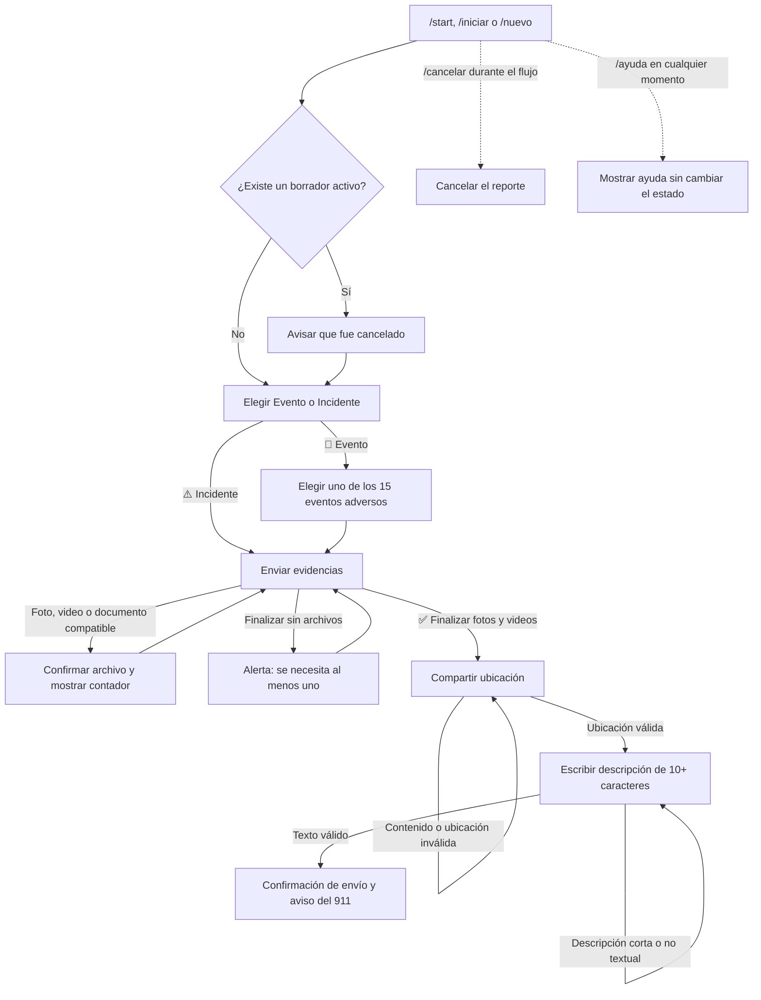

# Flujo de mensajes de Telegram — Galápagos Previene

Este documento describe la interacción que actualmente implementa el bot de
Telegram. Incluye los mensajes que ve el usuario, los botones disponibles, las
validaciones, las rutas de error y los cambios de estado del reporte.

> Fuente de verdad revisada: `app/bot.py`, `app/handlers/commands.py`,
> `app/handlers/report_flow.py`, `app/handlers/errors.py`, `app/keyboards.py`,
> `app/states.py`, `app/services/telegram_media.py`, repositorios, esquema SQL y
> pruebas. La API REST de `app/api/` es un consumidor externo y no agrega
> mensajes a la conversación de Telegram.

## 1. Resumen del recorrido

El reporte se considera enviado únicamente después de recibir una descripción
válida. Antes de eso permanece como borrador (`DRAFT`) en PostgreSQL.

## 2. Comandos disponibles

El menú de Telegram muestra estos cuatro comandos:

| Comando | Texto del menú | Efecto |
|---|---|---|
| `/iniciar` | Crear un reporte | Inicia el flujo. |
| `/nuevo` | Reportar algo más | Inicia el mismo flujo. |
| `/cancelar` | Cancelar el reporte | Cancela el borrador activo, si existe. |
| `/ayuda` | Ver ayuda | Muestra ayuda sin alterar el reporte. |

`/start` también inicia el flujo, aunque no aparece en el menú configurado por
el bot. Es el comando que Telegram usa normalmente al pulsar **Iniciar** por
primera vez.

Los comandos `/start`, `/iniciar` y `/nuevo` pueden utilizarse incluso durante
una conversación activa. En ese caso se abandona el recorrido actual, se
cancela lógicamente el borrador anterior y se comienza desde la selección del
tipo de reporte.

## 3. Flujo principal, mensaje por mensaje

### Paso 1 — Iniciar o reiniciar

**Acción del usuario**

Envía `/start`, `/iniciar` o `/nuevo`.

Si ya tenía un borrador activo, primero recibe un mensaje independiente:

> El borrador anterior fue cancelado.

Ese mensaje también ordena ocultar cualquier teclado de respuesta anterior.
Después, tanto para un usuario nuevo como para uno que reinició, el bot envía:

> 🌿 ¡Hola! Bienvenido a Galápagos Previene.
>
> Aquí puedes avisarnos de algo que esté pasando en las islas.
>
> ¿Qué quieres reportar?

**Botones inline, en una misma fila**

- `🌋 Evento`
- `⚠️ Incidente`

**Estado de conversación:** `CHOOSE_KIND`.

### Paso 2A — Ruta Evento

**Acción del usuario**

Pulsa `🌋 Evento`.

El bot crea el borrador y edita el mensaje de selección para mostrar:

> ¿Qué tipo de evento quieres reportar?

**Botones inline, dos por fila**

- `🌊 Tsunami` · `🌋 Erupción volcánica`
- `🌧️ Lluvias intensas` · `💧 Inundación`
- `🌊 Oleaje` · `🏜️ Sequía`
- `⚗️ Cont. química` · `🚤 Acc. acuático`
- `🐛 Plaga` · `🔥 Inc. forestal`
- `🌍 Sismo` · `🏗️ Colapso infra.`
- `⛰️ Deslizamiento` · `🧱 Caídas`
- `🌬️ Vendaval`

**Estado de conversación:** `CHOOSE_EVENT_TYPE`.

Cuando el usuario elige cualquiera de los quince tipos, el bot guarda la
selección y vuelve a editar ese mensaje:

> Evento: `{nombre del evento elegido}` ✓
>
> 📸 Ahora envíame fotos o videos de lo que está pasando.
>
> Puedes enviar varios.

Inmediatamente envía un segundo mensaje:

> Cuando termines, pulsa el botón de abajo.

**Botón inline**

- `✅ Finalizar fotos y videos`

**Siguiente estado:** `WAITING_MEDIA`.

### Paso 2B — Ruta Incidente

**Acción del usuario**

Pulsa `⚠️ Incidente`.

No se solicita un subtipo. El bot crea el borrador y edita el mensaje de
selección para mostrar:

> Incidente ✓
>
> 📸 Ahora envíame fotos o videos de lo que está pasando.
>
> Puedes enviar varios.

Después envía un segundo mensaje:

> Cuando termines, pulsa el botón de abajo.

**Botón inline**

- `✅ Finalizar fotos y videos`

**Siguiente estado:** `WAITING_MEDIA`.

### Paso 3 — Registrar fotos y videos

El usuario puede enviar repetidamente:

- una foto nativa de Telegram;
- un video nativo de Telegram;
- una imagen enviada como documento, si su MIME comienza con `image/`;
- un video enviado como documento, si su MIME comienza con `video/`;
- un álbum, que Telegram entrega al bot como varios mensajes individuales.

El pie de foto, si existe, se almacena como metadato. No se descarga el archivo:
se conservan sus identificadores de Telegram.

Por cada archivo nuevo aceptado, el bot responde:

> ✅ Archivo recibido (`{cantidad}` de `{límite}`).
>
> Puedes enviar más o pulsar el botón para continuar.

El mensaje conserva el botón:

- `✅ Finalizar fotos y videos`

`{límite}` corresponde a `MAX_MEDIA_FILES`; el valor predeterminado es **10**.

Si Telegram vuelve a entregar el mismo mensaje y el archivo ya había sido
registrado, el bot responde:

> ℹ️ Ese archivo ya lo tenía (`{cantidad}` de `{límite}`).
>
> Puedes enviar más o pulsar el botón para continuar.

Si ya se alcanzó el máximo configurado:

> Máximo `{límite}` archivos. Pulsa el botón para continuar.

Si se envía texto, audio, un documento con MIME no admitido u otro contenido
en este paso:

> 📸 Necesito una foto o video. Si ya terminaste, pulsa el botón.

La implementación también contiene este mensaje defensivo para un archivo que
llegue al extractor pero no pueda clasificarse como imagen o video:

> Formato no válido. Envía una foto o video.

Todos estos casos mantienen el estado `WAITING_MEDIA` y vuelven a mostrar el
botón de finalización.

### Paso 4 — Finalizar evidencias

**Acción del usuario**

Pulsa `✅ Finalizar fotos y videos`.

Si todavía no registró ninguna evidencia, Telegram muestra una alerta:

> Envíame al menos una foto o video antes de continuar.

El usuario permanece en `WAITING_MEDIA`.

Si existe al menos una evidencia, el bot edita el mensaje que contenía el
botón:

> ✅ Listo, recibí `{cantidad}` archivo(s).

Después envía un nuevo mensaje:

> 📍 Compárteme tu ubicación.

**Botón de teclado de respuesta**

- `📍 Compartir mi ubicación`

Telegram solicita el consentimiento del usuario antes de compartir la
ubicación. También es válida una ubicación elegida manualmente desde el mapa.

**Siguiente estado:** `WAITING_LOCATION`.

### Paso 5 — Compartir la ubicación

Al recibir una ubicación válida, el bot guarda latitud, longitud y precisión,
oculta el teclado de ubicación y responde:

> ✅ Listo.
>
> ✍️ Último paso: cuéntame brevemente qué ocurrió.

**Siguiente estado:** `WAITING_DESCRIPTION`.

Las coordenadas deben ser numéricas y finitas, con latitud entre `-90` y `90`
y longitud entre `-180` y `180`.

Si Telegram entrega un objeto de ubicación con coordenadas inválidas:

> Esa ubicación no es válida. Compártela otra vez.

Si la ubicación es válida pero ya no puede guardarse en el paso actual:

> No pudimos guardar la ubicación. Compártela otra vez o usa /iniciar.

Si el usuario envía texto, archivos u otro contenido en lugar de una ubicación:

> 📍 Usa el botón para compartir tu ubicación.

En los tres casos se mantiene `WAITING_LOCATION` y se vuelve a mostrar el botón
`📍 Compartir mi ubicación`.

### Paso 6 — Escribir la descripción

El usuario debe enviar un mensaje de texto con al menos 10 caracteres después
de quitar los espacios del principio y del final. Los espacios internos se
conservan.

Si el texto tiene menos de 10 caracteres:

> La descripción debe tener al menos 10 caracteres.

Si envía una foto, video, ubicación u otro contenido no textual:

> ✍️ Escríbeme la descripción como mensaje de texto.

Ambas respuestas mantienen el estado `WAITING_DESCRIPTION`.

### Paso 7 — Confirmación final

Con una descripción válida, el bot vuelve a comprobar la integridad del
reporte, lo marca como enviado (`SUBMITTED`), limpia la sesión temporal y
responde:

> ✅ ¡Listo! Tu reporte fue enviado.
>
> Gracias por ayudar a cuidar Galápagos 🌿
>
> 🚨 Si es una emergencia, llama al 911.
>
> Escribe /nuevo para reportar algo más.

Por decisión de producto la confirmación no muestra el identificador interno
del reporte ni el conteo de archivos: no son datos útiles para el usuario en ese
momento. El aviso del 911 recuerda que este canal no atiende emergencias en
curso. El teclado de respuesta se oculta y la conversación termina.

## 4. Ayuda y cancelación

### `/ayuda`

Funciona dentro o fuera de un reporte y no modifica su estado:

> 🤖 Galápagos Previene
>
> Reportar es fácil, solo 4 pasos:
> 1️⃣ Elige qué pasó
> 2️⃣ Envía fotos o videos
> 3️⃣ Comparte tu ubicación
> 4️⃣ Cuéntanos brevemente
>
> Comandos:
> /iniciar - Nuevo reporte
> /nuevo - Registrar otro reporte
> /cancelar - Cancelar el reporte actual
> /ayuda - Ver esta ayuda
>
> 🚨 Si es una emergencia, llama al 911.

### `/cancelar` con un borrador activo

> Cancelado ✅ No enviamos nada.
>
> Cuando quieras, escribe /nuevo.

El reporte y las evidencias no se borran; quedan auditados con estado y paso
`CANCELLED`. Se limpia la sesión y se oculta el teclado de respuesta.

### `/cancelar` sin un borrador activo

> No tienes ningún reporte en curso. Escribe /iniciar para empezar.

## 5. Respuestas ante acciones fuera del paso esperado

| Situación | Respuesta visible | Resultado |
|---|---|---|
| Escribir en lugar de pulsar Evento/Incidente | `👆 Toca uno de los botones de arriba para continuar.` | Continúa en `CHOOSE_KIND`. |
| Escribir en lugar de elegir un tipo de evento | `👆 Toca uno de los botones de arriba para continuar.` | Continúa en `CHOOSE_EVENT_TYPE`. |
| Pulsar un botón viejo o que no pertenece al paso activo | Alerta: `Ese botón no corresponde al paso actual.` | No cambia de estado. |
| Callback de clase de reporte con valor inválido | Alerta: `Esa opción no es válida.` | Continúa en `CHOOSE_KIND`. |
| Callback de tipo de evento con valor inválido | Alerta: `Ese tipo de evento no es válido.` | Continúa en `CHOOSE_EVENT_TYPE`. |
| El tipo de evento válido no puede persistirse | Alerta: `No pudimos guardar esa opción. Intenta de nuevo.` | Continúa en `CHOOSE_EVENT_TYPE`. |
| Falta el identificador de la sesión durante una transición atendida | Alerta y mensaje: `Este reporte ya no está activo. Usa /iniciar.` | Limpia la sesión y termina la conversación. |
| Excepción no controlada con un mensaje al cual responder | `Hubo un problema. Intenta de nuevo o usa /iniciar.` | El detalle técnico solo queda en logs. |

Los callbacks con valores inválidos de las dos selecciones están bloqueados
normalmente por los patrones del enrutador; sus textos son protecciones
defensivas. Un callback distinto sí llega a la respuesta genérica de botón
fuera de paso cuando hay una conversación activa.

## 6. Estados y datos persistidos

| Estado de Telegram | Paso persistido | Qué espera del usuario |
|---|---|---|
| `CHOOSE_KIND` | Todavía no existe un reporte | Botón Evento o Incidente. |
| `CHOOSE_EVENT_TYPE` | `CHOOSE_EVENT_TYPE` | Uno de los 15 botones de evento. |
| `WAITING_MEDIA` | `WAITING_MEDIA` | Una o más evidencias y luego finalizar. |
| `WAITING_LOCATION` | `WAITING_LOCATION` | Una ubicación de Telegram. |
| `WAITING_DESCRIPTION` | `WAITING_DESCRIPTION` | Texto de al menos 10 caracteres. |
| Fin de conversación | `COMPLETED` | El reporte quedó `SUBMITTED`. |
| Fin por cancelación | `CANCELLED` | El reporte quedó `CANCELLED`. |

La selección Evento/Incidente es especial: el borrador se crea al pulsar uno de
los botones, no al ejecutar el comando inicial. Un Evento exige subtipo; un
Incidente conserva `event_type_id = NULL`.

## 7. Comportamiento relevante para la experiencia de usuario

- Solo puede existir un borrador activo por usuario. Iniciar otro cancela el
  anterior automáticamente.
- El flujo se identifica por usuario y chat (`per_user=True`, `per_chat=True`).
- Los mensajes se procesan secuencialmente. En un álbum, cada elemento produce
  su propia confirmación y contador.
- El botón de finalizar no espera a que termine un álbum por temporizador. El
  avance ocurre exclusivamente cuando el callback se procesa en la secuencia.
- No hay botones **Atrás**, **Cambiar tipo**, **Eliminar evidencia** o
  **Confirmar antes de enviar**. Para corregir una elección anterior hay que
  usar `/iniciar`, `/nuevo` o `/cancelar` y comenzar otra vez.
- Después de finalizar las evidencias ya no se aceptan archivos adicionales;
  se interpretan como contenido inesperado del paso de ubicación o descripción.
- Los comandos desconocidos no tienen un manejador propio y, por tanto, no
  generan una respuesta. Los mensajes normales enviados fuera de una
  conversación tampoco generan respuesta.
- El estado del borrador se guarda en PostgreSQL, pero la conversación de
  `python-telegram-bot` y el UUID activo viven solo en memoria: no hay una
  persistencia ni rutina de rehidratación configurada. Tras reiniciar el proceso,
  el usuario debe usar `/iniciar` o `/nuevo`; esto cancelará el borrador previo.
- El bot está diseñado para chat privado, aunque el código no aplica un filtro
  explícito que rechace grupos. La configuración documentada de BotFather
  recomienda deshabilitar su incorporación a grupos.

## 8. Inventario de elementos interactivos

### Botones inline

| Etiqueta visible | Valor interno | Paso válido |
|---|---|---|
| `🌋 Evento` | `kind:EVENT` | Selección de clase. |
| `⚠️ Incidente` | `kind:INCIDENT` | Selección de clase. |
| `🌊 Tsunami` | `event:TSU` | Selección de tipo de Evento. |
| `🌋 Erupción volcánica` | `event:ERV` | Selección de tipo de Evento. |
| `🌧️ Lluvias intensas` | `event:LLI` | Selección de tipo de Evento. |
| `💧 Inundación` | `event:INU` | Selección de tipo de Evento. |
| `🌊 Oleaje` | `event:OLJ` | Selección de tipo de Evento. |
| `🏜️ Sequía` | `event:SEQ` | Selección de tipo de Evento. |
| `⚗️ Cont. química` | `event:CQM` | Selección de tipo de Evento. |
| `🚤 Acc. acuático` | `event:AMA` | Selección de tipo de Evento. |
| `🐛 Plaga` | `event:PLG` | Selección de tipo de Evento. |
| `🔥 Inc. forestal` | `event:INF` | Selección de tipo de Evento. |
| `🌍 Sismo` | `event:SIS` | Selección de tipo de Evento. |
| `🏗️ Colapso infra.` | `event:COI` | Selección de tipo de Evento. |
| `⛰️ Deslizamiento` | `event:DES` | Selección de tipo de Evento. |
| `🧱 Caídas` | `event:CAD` | Selección de tipo de Evento. |
| `🌬️ Vendaval` | `event:VDV` | Selección de tipo de Evento. |
| `✅ Finalizar fotos y videos` | `media:finish` | Recepción de evidencias. |

### Teclado de respuesta

| Etiqueta visible | Función | Paso válido |
|---|---|---|
| `📍 Compartir mi ubicación` | Solicita a Telegram una ubicación con consentimiento. | Ubicación. |

## 9. Archivos responsables del flujo

- `app/bot.py`: registra comandos y handlers, y fuerza procesamiento secuencial.
- `app/handlers/commands.py`: inicio, reinicio, ayuda y cancelación.
- `app/handlers/report_flow.py`: mensajes, validaciones y transiciones.
- `app/keyboards.py`: etiquetas y organización de botones.
- `app/states.py`: estados en memoria y límite inicial de archivos.
- `app/services/telegram_media.py`: formatos aceptados y metadatos de evidencia.
- `app/repositories/reports.py`: creación, transición, cancelación y envío.
- `app/repositories/media.py`: contador, duplicados, límite y finalización.
- `schema.sql`: integridad permanente de reportes, pasos y evidencias.
- `tests/test_report_flow.py`, `tests/test_validations.py` y
  `tests/test_media_extraction.py`: contrato probado del recorrido.
